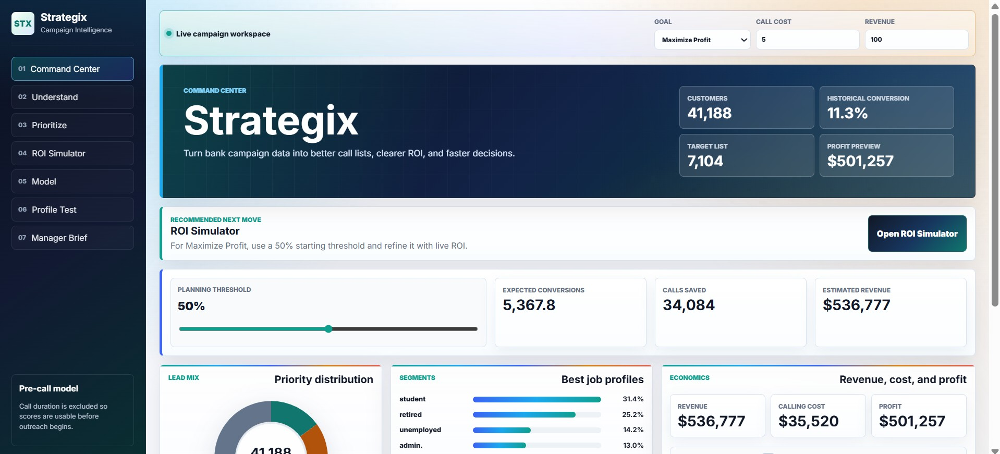

# Strategix

Strategix is an interactive bank campaign intelligence app that predicts which customers are most likely to subscribe to a term deposit. It combines a FastAPI machine-learning backend with a polished React/Vite frontend for lead prioritization, ROI simulation, model explainability, and manager-ready campaign briefs.



## Features

- React dashboard with responsive, Apple-inspired UI
- FastAPI backend serving both API endpoints and the production React build
- Random Forest classification model trained from the bank marketing dataset
- Pre-call customer scoring with `duration` excluded to avoid data leakage
- Ranked lead queue with score filters, priority filters, age/job filters, and CSV export
- ROI simulator for campaign threshold, call cost, revenue, profit, and calls saved
- Model explainability with feature importance and score-band validation
- Live customer profile testing through `/api/predict`
- Editable manager brief and recommended call-list export

## Tech Stack

- Frontend: React, Vite, CSS
- Backend: FastAPI, Uvicorn
- Data/ML: pandas, NumPy, scikit-learn
- Dataset: `bank-additional-full.csv`

## Project Structure

```text
Bank-Datathon/
|-- app.py                         # FastAPI backend and ML pipeline
|-- bank-additional-full.csv        # Required dataset
|-- model.pkl                       # Existing model artifact, not required by current app
`-- frontend/
    |-- package.json
    |-- vite.config.js
    |-- index.html
    `-- src/
        |-- App.jsx                 # Main React application
        |-- main.jsx
        `-- styles.css              # UI theme and interactions
```

## Setup

Clone the repository and move into the project folder:

```powershell
git clone <your-repo-url>
cd Bank-Datathon
```

Install Python dependencies:

```powershell
pip install fastapi uvicorn pandas numpy scikit-learn pydantic
```

Install frontend dependencies:

```powershell
cd frontend
npm install
```

Build the React frontend:

```powershell
npm run build
```

Return to the project root:

```powershell
cd ..
```

Run the app:

```powershell
python -m uvicorn app:app --host 127.0.0.1 --port 8000
```

Open the website:

```text
http://127.0.0.1:8000
```

## Development Mode

Use two terminals.

Terminal 1, from the project root:

```powershell
python -m uvicorn app:app --host 127.0.0.1 --port 8000
```

Terminal 2:

```powershell
cd frontend
npm run dev
```

Open:

```text
http://127.0.0.1:5173
```

Vite proxies `/api` requests to the FastAPI backend on port `8000`.

## API Endpoints

```text
GET  /api/health
GET  /api/bootstrap
POST /api/predict
```

Example prediction request:

```json
{
  "profile": {
    "age": 40,
    "job": "admin.",
    "marital": "married",
    "education": "university.degree",
    "default": "no",
    "housing": "yes",
    "loan": "no",
    "contact": "cellular",
    "month": "may",
    "day_of_week": "mon",
    "campaign": 1,
    "pdays": 999,
    "previous": 0,
    "poutcome": "nonexistent",
    "emp.var.rate": 1.1,
    "cons.price.idx": 93.994,
    "cons.conf.idx": -36.4,
    "euribor3m": 4.857,
    "nr.employed": 5191.0
  }
}
```

## Notes

- `bank-additional-full.csv` must be present in the project root.
- The current FastAPI app trains and caches the model at runtime from the CSV.
- `duration` is intentionally removed from features because it is only known after a customer call.
- `frontend/dist/` is generated by `npm run build` and is served by FastAPI in production mode.

## Verification Commands

```powershell
python -m py_compile app.py
```

```powershell
cd frontend
npm run build
```

```powershell
Invoke-WebRequest -UseBasicParsing http://127.0.0.1:8000/api/health
```

## License

This project is for educational and hackathon/demo use. Add a license file before publishing if you plan to distribute or reuse it publicly.

## Authors

- Anuja Sawant
Email : sawantanuja16@gmail.com
- Varshith Sai Manchem
Email :	manchemvarshith123@gmail.com
